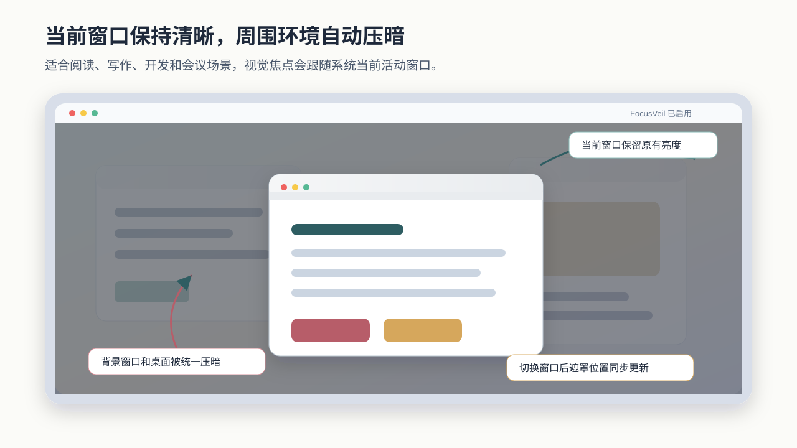
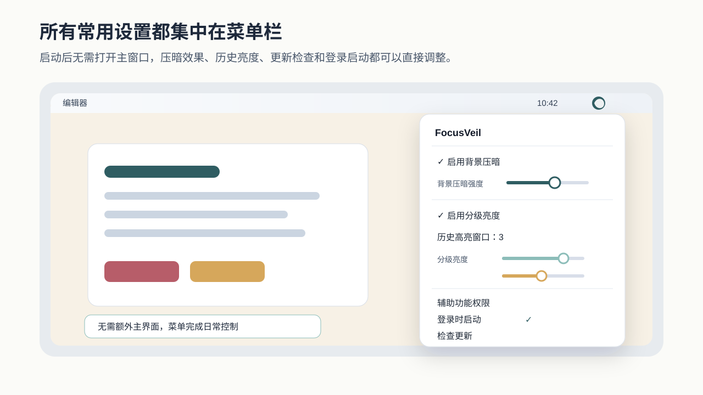
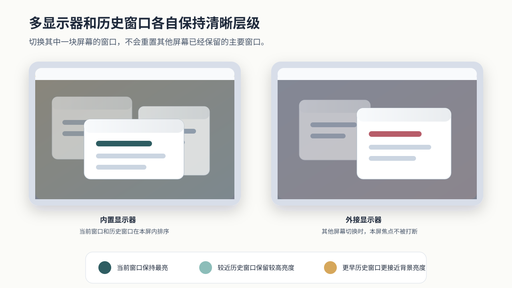

# FocusVeil

FocusVeil 是一款原生 macOS 菜单栏应用，用于在多窗口工作环境中突出当前视觉焦点。应用会跟随当前活动窗口，在保持该窗口原有亮度的同时压暗其他窗口和桌面背景，减少阅读、写作、开发和会议场景中的视觉干扰。

## 功能预览

下图为功能示意，实际窗口样式由 macOS 与用户正在使用的应用决定。FocusVeil 只根据窗口边界绘制遮罩，不截屏，也不读取窗口内容。



焦点压暗开启后，当前活动窗口保持原有显示效果，背景窗口与桌面区域按照用户设置降低亮度。切换应用窗口、关闭当前窗口或恢复桌面后，遮罩会跟随系统窗口层级重新定位。



FocusVeil 启动后常驻菜单栏。用户可以直接启用或关闭背景压暗，调整背景压暗强度，开启分级亮度，设置历史高亮窗口数量，检查新版本，并控制是否登录时启动。



在多显示器环境中，每块屏幕会维护自己的当前窗口。启用分级亮度后，最近活跃的历史窗口会按顺序保留不同亮度，使用户能保留上下文，同时仍然明确辨认当前焦点。

## 适用场景

- 同时打开编辑器、浏览器、终端和通讯工具，需要降低背景窗口干扰。
- 使用多个显示器，希望每块屏幕都保留自己的主要窗口。
- 在全屏空间、桌面空间和普通窗口之间切换时，希望焦点提示自然跟随系统窗口层级。

## 主要功能

- 自动跟随当前活动窗口，同一应用内的窗口切换也会同步更新。
- 当前应用窗口关闭后，自动让同一显示器上最靠前的可见窗口接管焦点。
- 支持多个显示器和全屏空间，每个显示器独立保留最近活跃窗口。
- 支持调节背景压暗强度。
- 支持分级亮度，让最近活跃的历史窗口按顺序保留不同亮度。
- 支持通过 Sparkle 从菜单栏检查、下载并安装新版本。
- 支持登录时启动。
- 不截屏、不录屏、不保存窗口内容。

## 系统要求

运行 FocusVeil 需要：

- macOS 13 或更高版本。
- 辅助功能权限。

从源码构建还需要安装 Xcode Command Line Tools。

辅助功能权限用于读取当前活动窗口的位置和尺寸。FocusVeil 不读取窗口中的文字、图像、文件内容或文件路径，也不包含遥测与数据上传逻辑。

## 安装与授权

1. 如通过 GitHub Releases 获取应用，请下载 `FocusVeil.dmg`；也可以按下方构建步骤在本地生成安装镜像。
2. 打开 DMG，将 `FocusVeil.app` 拖入 `Applications`。
3. 从应用程序文件夹打开 FocusVeil。
4. 在菜单栏中打开 FocusVeil 菜单，选择 `打开辅助功能设置`。
5. 在系统设置的隐私与安全性中，为 FocusVeil 启用辅助功能权限。
6. 回到日常使用的窗口后，FocusVeil 会开始跟随当前活动窗口。

如果系统设置没有直接打开到辅助功能页面，可以手动进入系统设置中的隐私与安全性，再进入辅助功能并启用 FocusVeil。

## 使用方式

FocusVeil 启动后常驻菜单栏。菜单中提供以下控制项：

- `启用背景压暗`：开启或关闭焦点压暗效果。
- `背景压暗强度`：调整非焦点区域的压暗程度。
- `启用分级亮度`：让最近活跃的历史窗口保留不同亮度。
- `历史高亮窗口`：设置当前窗口之外需要保留的历史窗口数量。
- `分级亮度`：分别调整各个历史层级相对于背景区域的亮度。
- `检查更新`：读取 Sparkle 更新源，发现新版本后在应用内完成下载、验证、安装和重启。
- `登录时启动`：控制应用是否随当前用户登录自动启动。

多显示器环境中，每个显示器会维护自己的当前窗口。例如外接显示器播放视频时，内置显示器切换到聊天窗口不会改变外接显示器的视频亮度。启用分级亮度后，历史窗口也会按显示器分别计算，避免不同屏幕之间互相影响。

检查更新功能使用 Sparkle 读取 GitHub Releases 中公开托管的 `appcast.xml`。发布新版本后，应用会校验更新包签名，并在用户确认后替换本机应用。后台自动检查默认开启，检查间隔为一天。

## 本地构建

### macOS

在仓库根目录运行：

```bash
zsh Scripts/build.sh
```

构建完成后，会生成压缩包和 DMG 安装镜像：

```text
outputs/FocusVeil.zip
outputs/FocusVeil.dmg
```

构建脚本会使用系统 clang 编译 Objective C 源码，链接并嵌入 Sparkle 框架，并使用本地临时签名生成应用包。DMG 中包含 `FocusVeil.app` 和 `Applications` 快捷入口，便于用户拖拽安装。临时签名适合个人使用和开发验证。面向其他用户分发时，应使用 Apple Developer 证书完成正式签名和公证。

### Windows

Windows 版源码位于 `Windows/FocusVeil`。在 Windows 环境中打开 PowerShell，运行：

```powershell
.\Windows\FocusVeil\Scripts\build.ps1
```

构建完成后会生成：

```text
outputs\windows\FocusVeil.exe
```

Windows 版使用原生 Win32 桌面接口实现托盘菜单、窗口识别、多显示器遮罩、分级亮度、登录启动和更新检查。当前更新检查会读取 GitHub Releases 最新版本信息，并由用户选择是否打开发布页下载。

面向普通用户分发 Windows 版时，可以生成安装程序：

```powershell
.\Windows\FocusVeil\Scripts\buildInstaller.ps1
```

生成的安装程序位于：

```text
outputs\windows\FocusVeilSetup.exe
```

如果没有 Windows 本机构建环境，可以使用 GitHub Actions 生成 Windows 产物。进入仓库的 Actions 页面，运行 `Build Windows` 工作流；构建完成后可下载 `FocusVeilWindows` 产物，其中包含 `FocusVeil.exe` 和 `FocusVeilSetup.exe`。使用 `v` 开头的 Git 标签发布时，工作流会把这两个文件附加到对应 GitHub Release。

## 项目结构

- `Sources/FocusVeil/main.m`：应用入口、菜单栏交互、窗口识别和遮罩控制逻辑。
- `Resources/Info.plist`：应用元数据、版本号和最低系统版本。
- `Resources/AppIcon.icns`：应用图标资源。
- `docs/images/`：README 中使用的功能示意图。
- `.github/workflows/windows.yml`：在 GitHub Actions 中构建 Windows 可执行文件和安装程序。
- `Scripts/build.sh`：本地构建、签名、压缩和 DMG 生成脚本。
- `Scripts/release.sh`：构建发布产物并生成 Sparkle appcast 的脚本。
- `Windows/FocusVeil/`：Windows 原生客户端源码、CMake 配置、安装器配置和 PowerShell 构建脚本。
- `Vendor/Sparkle/`：Sparkle 框架、发布工具和授权文件。
- `CHANGELOG.md`：面向用户的版本发布说明。

## 技术实现

FocusVeil 使用 macOS 辅助功能接口获取当前活动窗口的几何信息，并结合系统窗口列表确定普通窗口的窗口编号、显示器归属和可见层级。应用通过透明的全屏面板绘制压暗层，并按显示器将压暗层放置到对应窗口下方，使当前窗口保持原有显示，其余区域按用户设置压暗。

启用分级亮度后，应用会为每个显示器记录最近活跃的窗口编号，并按活跃顺序叠放不同透明度的压暗层。历史层级亮度以相对于背景压暗区域的保留亮度保存，背景压暗强度变化时，层级关系会按比例保持。

## 发布维护

发布新版本时建议同步完成以下事项：

- 更新 `Resources/Info.plist` 中的 `CFBundleShortVersionString` 和 `CFBundleVersion`。
- 更新 `CHANGELOG.md`，说明用户可感知的变化、影响范围和验证建议。
- 运行 `zsh Scripts/release.sh` 生成新的 `outputs/FocusVeil.zip`、`outputs/FocusVeil.dmg`、`outputs/appcast.xml` 和发布说明。
- 使用版本号创建 Git 标签，并将 DMG、zip、appcast 和发布说明上传到 GitHub Releases。

仓库只保存源码、资源文件、构建脚本和项目说明。构建产物、压缩包、系统元数据、模块缓存以及 Xcode 用户状态文件不纳入版本控制。
